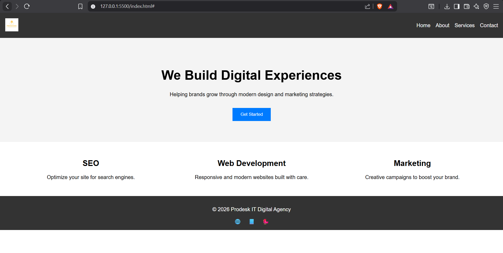

# mission1-prodesk-it

# Prodesk IT Digital Agency - Mission 1 (Level 1)

A responsive landing page built with raw CSS (Flexbox/Grid) for the fictional digital agency **Prodesk IT**.

---

## 📸 Screenshot (Desktop View)


*(Replace `screenshot.png` with your actual screenshot of the site running on desktop view. Save it inside `assets/images/`.)*

---

## 🚀 Live Demo
[View Site on Netlify](https://prodesk-mission1.netlify.app/)

*(After deploying to Netlify/Vercel, paste the live URL here.)*

---

## 🛠️ How to Run Locally
1. Clone the repository:
   ```bash
   git clone https://github.com/Afrid011/mission1-prodesk-it.git
